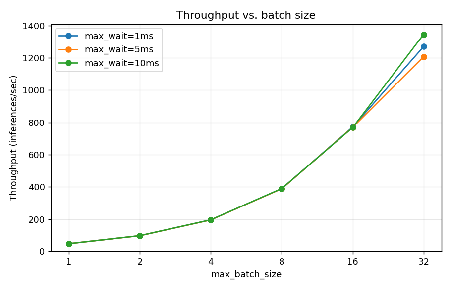
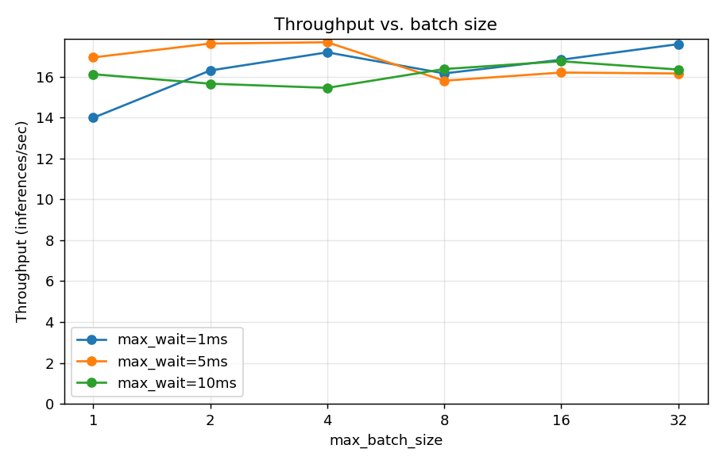
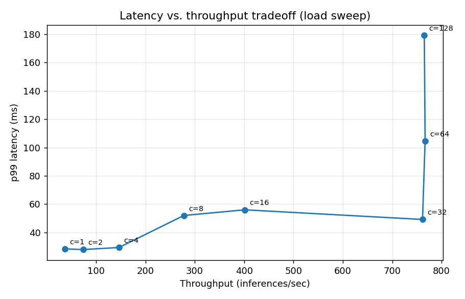
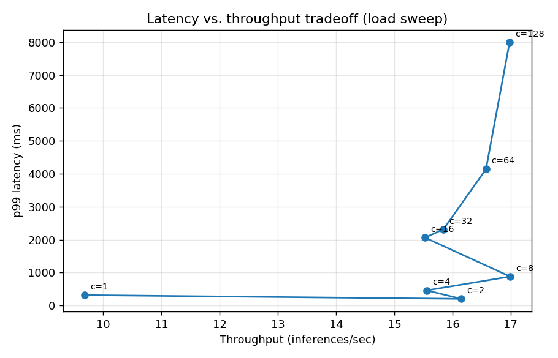

# Results — Dynamic Batching: when it helps, and when it doesn't

Two engines were benchmarked through the **same** server, batcher, queue, router,
and client — the only thing that changed is the engine behind the
`InferenceEngine` interface. That isolation is the point: it turns "does
batching help?" into a clean, controlled experiment.

- **`dummy/`** — `DummyEngine`, a fixed ~20 ms cost *per batch* (models the
  accelerator / GPU regime, where per-batch launch cost dominates and compute
  is cheap per item).
- **`onnx/`** — real ResNet-50 via ONNX Runtime, **CPU** execution provider
  (compute-bound: per-image cost is real and additive).

Setup: 64 concurrent closed-loop clients, batch sweep over
`max_batch ∈ {1,2,4,8,16,32}` × `max_wait_ms ∈ {1,5,10}`; a separate load sweep
(fixed batch=16, concurrency 1→128) for the latency/throughput tradeoff. All
numbers are from real runs on this machine (8-core CPU, WSL2). Raw data:
[`onnx/results.csv`](onnx/results.csv), [`dummy/results.csv`](dummy/results.csv).

## Headline: throughput vs. batch size

| max_batch | Dummy (fixed-cost) | ONNX ResNet-50 (CPU) |
|--:|--:|--:|
| 1 (baseline) | 49 inf/s | 16 inf/s |
| 2 | 99 inf/s (2.0×) | ~16 inf/s |
| 4 | 196 inf/s (4.0×) | ~17 inf/s |
| 8 | 389 inf/s (7.9×) | ~16 inf/s |
| 16 | 771 inf/s (15.6×) | ~17 inf/s |
| 32 | **1345 inf/s (27×)** | ~17 inf/s (≈1.1×, noise) |

(Full tables incl. p50/p95/p99: [`dummy/results_table.md`](dummy/results_table.md),
[`onnx/results_table.md`](onnx/results_table.md).)

## Plots

**Batching helps — DummyEngine** (throughput rises steeply with batch size):



**Batching does NOT help — real ResNet-50 on CPU** (flat, y-axis from 0):



**Latency/throughput tradeoff** (load sweep; throughput saturates, then p99
climbs as load piles up):




## Findings

- **Dummy engine: 49 → 1345 inf/s, a 27× gain** as batch grows 1→32, because its
  cost is *fixed per batch* — every extra request in a batch is essentially
  free, so `ms/img = 20/N` falls as `1/N`. This is the regime dynamic batching
  is built for.
- **Real ResNet-50 on CPU: flat ~16 inf/s regardless of batch** (peak 1.13×, i.e.
  noise). The CPU is compute-bound — one `run()` over N images does ≈ N× the
  FLOPs and takes ≈ N× as long (verified directly: `ms/img` is constant across
  batch sizes). There's no fixed per-batch cost to amortize, so batching can't
  raise throughput. Confirmed *not* a bug: each run's server log shows the
  correct `max_batch`, and 0 errors.
- **Tradeoff:** in the load sweep, throughput rises with offered load until it
  saturates, after which extra load only inflates tail latency (p99) — for both
  engines.

**Caveat / why this matters:** the batching *throughput* win requires an
accelerator-like fixed-cost-per-batch profile. A **GPU** provides exactly that
(cheap per-item compute, dominant per-batch launch/latency), so on GPU the real
ResNet-50 curve would rise like the dummy's — moderately on a small card
(~2–5×), dramatically on a big one. On a compute-saturated CPU it stays flat.
The DummyEngine result is the honest stand-in for the GPU regime; the ONNX-CPU
result is the honest ceiling of this hardware.

## Reproduce

```bash
# ONNX-CPU sweeps
RESULTS_SUBDIR=onnx ENGINE=onnx ./scripts/sweep.sh
RESULTS_SUBDIR=onnx ENGINE=onnx MODE=load ./scripts/sweep.sh
RESULTS_SUBDIR=onnx python3 scripts/make_table.py && RESULTS_SUBDIR=onnx python3 scripts/plot.py

# Dummy sweeps
RESULTS_SUBDIR=dummy ENGINE=dummy ./scripts/sweep.sh
RESULTS_SUBDIR=dummy ENGINE=dummy MODE=load ./scripts/sweep.sh
RESULTS_SUBDIR=dummy python3 scripts/make_table.py && RESULTS_SUBDIR=dummy python3 scripts/plot.py
```
